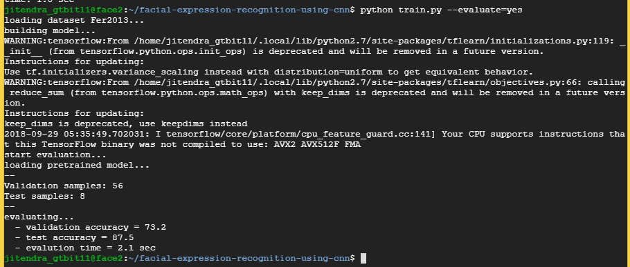

# sentiment_analysis_face

To train the model, we used Fer2013 datset that contains 30,000 images of facial expressions grouped in seven categories: Angry, Disgust, Fear, Happy, Sad, Surprise and Neutral.

 

The faces are first detected using opencv, then we extract the face landmarks using dlib. We also extracted the HOG features and we input the raw image data with the face landmarks+hog into a convolutional neural network.

 
For our experiments, we used  CNN models:
  

 

## Download and prepare the data

Download Fer2013(Kaggle Fer2013 challenge) dataset and the Face Landmarks model(Dlib Shape Predictor model)

 

## Train the model

The training parameters were define at parameters.py

<code>python train.py --train=yes</code>
 

 

## Evaluate the model

The evaluation parameters were define at parameters.py 
Set "save_model_path" parameter to the path of your pretrained file.

<code>python train.py --evaluate=yes</code>
 

 

## Prediction the model

The prediction parameters were define at parameters.py 
Set "save_model_path" parameter to the path of your pretrained file.

<code>python index.py --image=sample1.png</code>
 

Extract face from input image 

 

 

Then prediction on each image 

 

